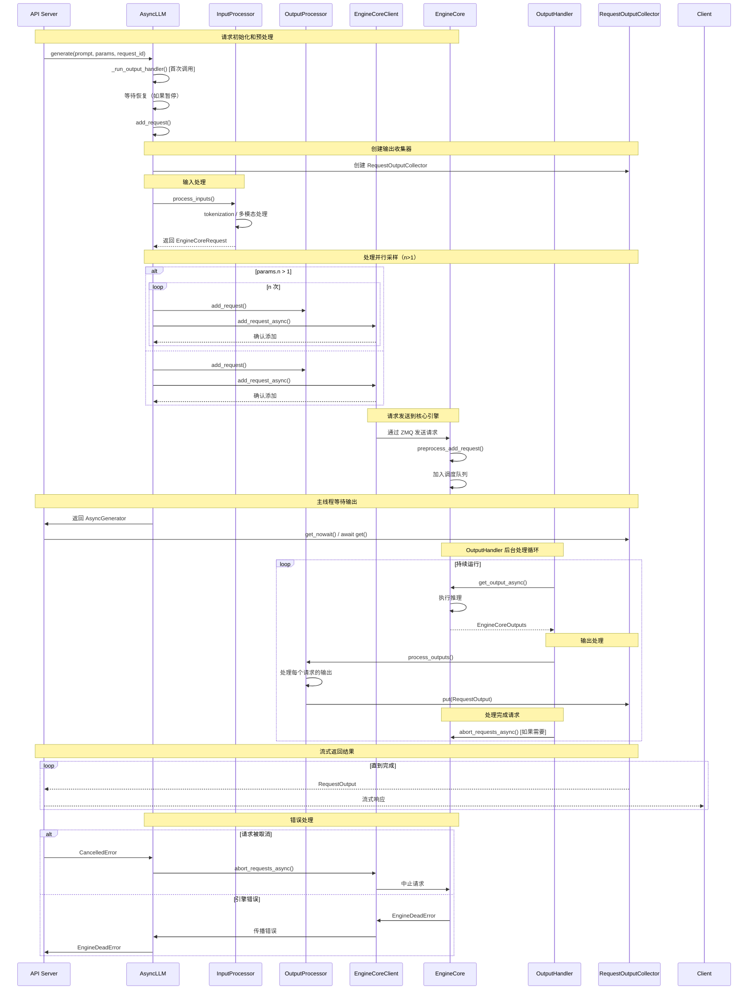

# vLLM AsyncLLM Request 处理流程分析

## 概述

本文档分析了 vLLM 中 AsyncLLM 的请求处理逻辑，重点梳理了当一个 request 到达后的完整调用链路和处理流程。

## 核心组件架构

### 1. AsyncLLM ([`async_llm.py:55`](vllm/v1/engine/async_llm.py#L55))
AsyncLLM 是 vLLM 的异步引擎接口，继承自 EngineClient，负责：
- 接收外部请求（如来自 API 服务器的请求）
- 协调输入处理、输出处理和核心引擎之间的交互
- 管理请求的生命周期

### 2. 主要组件
- **InputProcessor** ([`input_processor.py:42`](vllm/v1/engine/input_processor.py#L42)): 处理输入数据，包括 tokenization、多模态数据等
- **OutputProcessor** ([`output_processor.py:91`](vllm/v1/engine/output_processor.py#L91)): 处理输出数据，管理请求状态
- **EngineCoreClient** ([`core_client.py:62`](vllm/v1/engine/core_client.py#L62)): 与后台 EngineCore 进程通信的客户端
- **EngineCore** ([`core.py:78`](vllm/v1/engine/core.py#L78)): 实际的推理引擎，运行在独立进程中

## 请求处理完整流程

### 1. 请求入口点

当一个请求到达时，主要通过以下方法进入：

#### `generate()` 方法 ([`async_llm.py:361`](vllm/v1/engine/async_llm.py#L361))
```python
async def generate(
    self,
    prompt: EngineCoreRequest | PromptType,
    sampling_params: SamplingParams,
    request_id: str,
    ...
) -> AsyncGenerator[RequestOutput, None]:
```

这是生成任务的主要入口点，被 API 服务器调用。

### 请求处理时序图

下面是 AsyncLLM 处理一个完整请求的时序图，展示了各个组件之间的交互：



### 2. 请求处理流程

#### 步骤 1: 请求预处理 ([`async_llm.py:401-429`](vllm/v1/engine/async_llm.py#L401-L429))
1. 启动 output_handler 后台任务
2. 等待引擎恢复（如果处于暂停状态）
3. 验证截断参数
4. 调用 `add_request()` 添加请求

#### 步骤 2: 添加请求 ([`async_llm.py:273`](vllm/v1/engine/async_llm.py#L273))
```python
async def add_request(
    self,
    request_id: str,
    prompt: EngineCoreRequest | PromptType,
    params: SamplingParams | PoolingParams,
    ...
) -> RequestOutputCollector:
```

处理过程：
1. 创建 `RequestOutputCollector` 用于收集输出
2. 通过 `InputProcessor.process_inputs()` 将输入转换为 `EngineCoreRequest`
3. 处理并行采样（n>1 的情况）
4. 调用 `_add_request()` 将请求添加到系统

#### 步骤 3: 请求分发 ([`async_llm.py:339`](vllm/v1/engine/async_llm.py#L339))
```python
async def _add_request(
    self,
    request: EngineCoreRequest,
    prompt: str | None,
    parent_req: ParentRequest | None,
    index: int,
    queue: RequestOutputCollector,
):
```

关键操作：
1. 将请求添加到 `OutputProcessor` ([`async_llm.py:348`](vllm/v1/engine/async_llm.py#L348))
2. 通过 `EngineCoreClient.add_request_async()` 发送到后台 EngineCore ([`async_llm.py:351`](vllm/v1/engine/async_llm.py#L351))

### 3. EngineCore 处理

#### 请求接收和预处理 ([`core_client.py:959`](vllm/v1/engine/core_client.py#L959))
```python
async def add_request_async(self, request: EngineCoreRequest) -> None:
    request.client_index = self.client_index
    await self._send_input(EngineCoreRequestType.ADD, request)
    self._ensure_output_queue_task()
```

EngineCore 在独立进程中接收请求：
1. 通过 ZMQ 接收请求 ([`core.py:1062`](vllm/v1/engine/core.py#L1062))
2. 调用 `preprocess_add_request()` 预处理 ([`core.py:1064`](vllm/v1/engine/core.py#L1064))
3. 将请求加入调度队列

### 4. 输出处理循环

#### Output Handler 后台任务 ([`async_llm.py:473`](vllm/v1/engine/async_llm.py#L473))
```python
def _run_output_handler(self):
```

这个后台循环持续运行：
1. 从 EngineCore 获取输出 ([`async_llm.py:491`](vllm/v1/engine/async_llm.py#L491))
2. 通过 `OutputProcessor.process_outputs()` 处理输出 ([`async_llm.py:511`](vllm/v1/engine/async_llm.py#L511))
3. 将处理后的输出放入对应请求的队列
4. 处理需要中止的请求 ([`async_llm.py:522`](vllm/v1/engine/async_llm.py#L522))

### 5. 响应返回

在 `generate()` 方法中，通过循环从队列获取输出：
```python
while not finished:
    out = q.get_nowait() or await q.get()  # [`async_llm.py:437`](vllm/v1/engine/async_llm.py#L437)
    finished = out.finished
    yield out
```

## 关键数据流

### 请求对象转换流程
1. **原始输入** (PromptType: str | Mapping | list)
2. **→ EngineCoreRequest** ([`input_processor.py`](vllm/v1/engine/input_processor.py))
3. **→ Request** (EngineCore 内部对象) ([`core.py:561`](vllm/v1/engine/core.py#L561))
4. **→ EngineCoreOutput** (EngineCore 输出)
5. **→ RequestOutput** (最终输出给用户)

### 异步任务架构
- **主线程**: 处理 API 调用，管理请求生命周期
- **Output Handler Task**: 后台异步任务，处理 EngineCore 输出
- **EngineCore Process**: 独立进程，执行实际推理

## 错误处理机制

1. **请求取消**: 捕获 `asyncio.CancelledError`，调用 `abort()` ([`async_llm.py:448`](vllm/v1/engine/async_llm.py#L448))
2. **引擎死亡**: 捕获 `EngineDeadError` ([`async_llm.py:455`](vllm/v1/engine/async_llm.py#L455))
3. **验证错误**: 捕获 `ValueError` ([`async_llm.py:461`](vllm/v1/engine/async_llm.py#L461))
4. **其他错误**: 调用 `abort()` 并抛出 `EngineGenerateError` ([`async_llm.py:467`](vllm/v1/engine/async_llm.py#L467))

## 特殊功能

### 暂停/恢复机制
- `pause_generation()`: 暂停生成，可选择等待或中止正在进行的请求 ([`async_llm.py:556`](vllm/v1/engine/async_llm.py#L556))
- `resume_generation()`: 恢复生成 ([`async_llm.py:595`](vllm/v1/engine/async_llm.py#L595))

### 动态扩缩容
- `scale_elastic_ep()`: 动态调整数据并行大小 ([`async_llm.py:823`](vllm/v1/engine/async_llm.py#L823))

## 总结

vLLM 的 AsyncLLM 采用多进程异步架构，实现了高效的请求处理：

1. **清晰的职责分离**: 输入处理、推理执行、输出处理各司其职
2. **异步并发**: 使用 asyncio 实现高效的并发处理
3. **进程隔离**: EngineCore 运行在独立进程，提高稳定性
4. **流式输出**: 支持实时返回生成的 token
5. **灵活的资源管理**: 支持暂停/恢复、动态扩缩容等功能

这种设计使得 vLLM 能够高效地处理大量并发的推理请求，同时保持良好的响应性能和资源利用率。